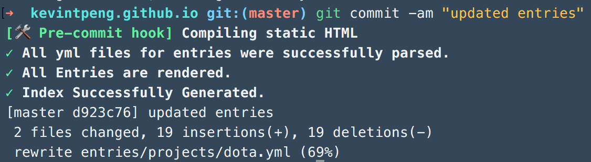

# [kpeng.ca](http://kpeng.ca)
This is my personal website, I've written a site generator to more easily modularize my landing page components. Each entry for work experience, projects, or awards is auto generated, from `/entries/*.yml` files.
- git hooks are used to pre-compile static html using ruby
- custom designing the html and css for the site, repetitive components were modularized
- content is defined using `YAML`, `markdown`, and `erb`
- converts files trees of `markdown` files to a website

### Editing & Developing
This integrates dev, a command line tool that I developed at Shopify. To start editing and developing:

1. Install dev
2. run `dev up`
3. Make changes and run `dev setup` to setup git pre-commit hooks 

